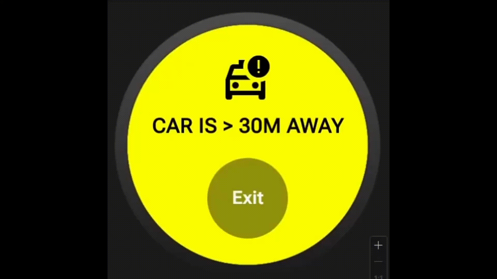

# 🚸 UvA Safe Crosswalk - Real-Time AI Detection


**TO BE UPDATED**



This project implements a real-time, distributed computer vision system designed to monitor crosswalk safety. It captures live video from a Raspberry Pi, transmits it over a local network using ZeroMQ, and processes the frames on a more powerful machine using a YOLO object detection model.

## 🏗️ System Architecture

The system is split into two main components to ensure high performance and low latency:

1. **The Edge Node (Raspberry Pi 3):** Captures video via a USB camera, compresses the frames, and broadcasts them as raw bytes over the network using a ZeroMQ (`PUB`) socket.
2. **The Processing Node (Windows PC):** Subscribes to the ZeroMQ (`SUB`) stream, decodes the frames, and runs a YOLO object detection model to identify pedestrians and crosswalk boundaries in real-time.

## ⚙️ Prerequisites

**Hardware:**
* Raspberry Pi 3 (with a USB Web Camera attached)
* Processing Computer (Windows/Linux/macOS)
* Both devices must be on the same Local Area Network (LAN).

**Software:**
* Python 3.9+
* Git

## 🚀 Installation & Setup

### 1. Clone the Repository
Clone this repository to **both** your Raspberry Pi and your processing computer:
```bash
git clone [https://github.com/GiangNguyen06/UvA-Safe-Crosswalk.git](https://github.com/GiangNguyen06/UvA-Safe-Crosswalk.git)
cd UvA-Safe-Crosswalk
```

### 2. Install Dependencies
Install the required packages on both machines:
```bash
pip install opencv-python pyzmq python-dotenv ultralytics numpy
```

### 3. Environment Variables (.env)
For security and portability, network configurations are kept out of the source code. 
Create a `.env` file in the **root directory** of both machines.

**On the Raspberry Pi (`.env`):**
```ini
ZMQ_PORT=5555
```

**On the Processing PC (`.env`):**
```ini
PI_IP=192.168.x.x  # Replace with your Pi's actual IP address
ZMQ_PORT=5555
```

## 🏃‍♂️ Usage

**Step 1: Start the Camera Stream (Raspberry Pi)**
SSH into your Raspberry Pi and start the broadcaster:
```bash
cd UvA-Safe-Crosswalk
python3 camera_pi/camera_stream.py
```
*You should see a message indicating the ZeroMQ server has started on port 5555.*

**Step 2: Start the AI Detector (Processing PC)**
On your laptop, run the receiving script to view the live AI feed:
```bash
cd UvA-Safe-Crosswalk
python processing/receive_stream.py
```
*Press `q` to safely quit the video stream window.*

## 📁 Project Structure

```text
UvA-Safe-Crosswalk/
├── camera_pi/                 # Code executed on the Raspberry Pi
│   └── camera_stream.py       # Captures and broadcasts video frames
├── processing/                # Code executed on the processing PC
│   ├── receive_stream.py      # Subscribes to stream and visualizes output
│   └── detector.py            # YOLO model inference logic
├── .env.example               # Template for environment variables
├── .gitignore                 # Excludes weights, videos, and secrets
└── README.md                  # Project documentation
```

---
## 👥 Team Members

Developed for the University of Amsterdam by:
* **Marieke Elzer** (13878808)
* **Soufiane el Ouaâzizi** (11706732)
* **Stijn Nagtzaam** (16036883)
* **Giang Nguyen** (16265858)
* **Dimitris Thomopoulos** (16017226)
